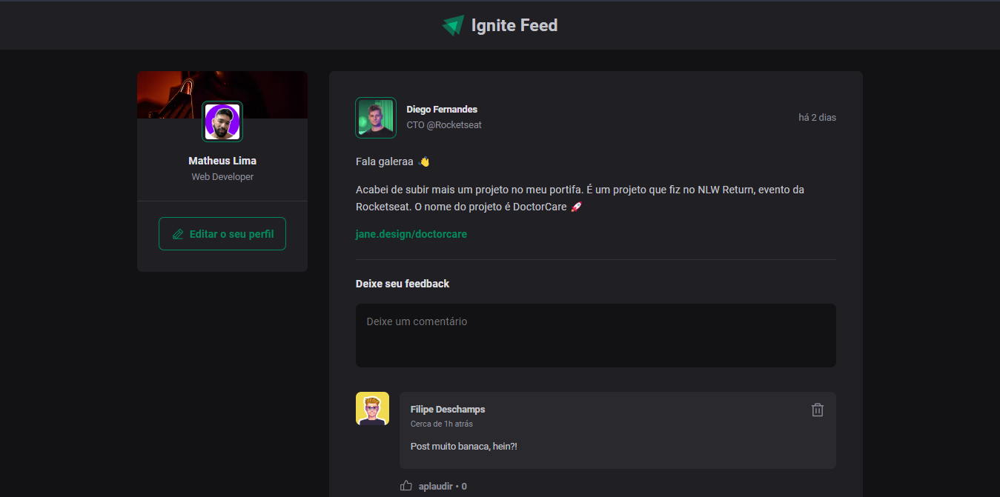

<div id="top"></div>

<!-- PROJECT LOGO -->
<br />
<div align="center">
  <a href="https://ignite-feedts.netlify.app/">
    
  </a>

  <h3 align="center">Ignite Feed - React Ts</h3>

  <p align="center">
    Simulador de um feed de rede social, contruído com React + Typescript.
    <br />
    <br />
    <a href="https://ignite-feedts.netlify.app/">View Demo</a>
    ·
    <a href="https://github.com/matheuslima99/ignite-feed-react-ts/issues">Report Bug</a>
    ·
    <a href="https://github.com/matheuslima99/ignite-feed-react-ts/issues">Request Feature</a>
  </p>
</div>


<!-- TABLE OF CONTENTS -->
<details>
  <summary>Table of Contents</summary>
  <ol>
    <li>
      <a href="#sobre-o-projeto">Sobre o projeto</a>
      <ul>
        <li><a href="#construído-com">Construído com</a></li>
      </ul>
    </li>
    <li>
      <a href="#começando">Começando</a>
      <ul>
        <li><a href="#instalação">Instalação</a></li>
      </ul>
    </li>
    <li><a href="#contribuindo">Contribuir</a></li>
    <li><a href="#licença">Licença</a></li>
    <li><a href="#contato">Contato</a></li>
  </ol>
</details>


<!-- ABOUT THE PROJECT -->
## Sobre o projeto

 <a href="">
    
  
  </a>

Primeiro projeto finalizado durante a trila de #ReactJs do curso Ignite, realizado pela Rocketseat. A ídeia foi simular um feed de uma rede social, onde fosse possível adicionar um novo comentário, remover ou também deixar o like. O projeto foi feito com React + Vite, utilizando o typescript e também algumas ferramentas como phosphor-react para ícones e o date-fns para formatar datas e horários.

<p align="right">(<a href="#top">back to top</a>)</p>


### Construído com

* [Typescript](https://www.typescriptlang.org/)
* [React.js](https://reactjs.org/)
* [date-fns](https://date-fns.org/)
* [Phosphor icons](https://phosphoricons.com/)


<p align="right">(<a href="#top">back to top</a>)</p>


<!-- GETTING STARTED -->
## Começando

Você precisa ter o NodeJs instalado


###   Instalação

1. Clonar o repositório
   ```sh
   git clone https://github.com/matheuslima99/ignite-feed-react-ts
   ```
2. Instalar pacotes NPM
   ```sh
   npm install
   ```
3. Para executar no seu dispositivo

   ```sh
   npm run dev 
   ```

<p align="right">(<a href="#top">back to top</a>)</p>


<!-- CONTRIBUTING -->
## Contribuindo

As contribuições são o que tornam a comunidade de código aberto um lugar tão incrível para aprender, inspirar e criar. Quaisquer contribuições que você fizer são muito apreciadas.

1. Fork do Projeto
2. Crie sua ramificação de recursos (`git checkout -b feature/AmazingFeature`)
3. Confirme suas alterações (`git commit -m 'Add some AmazingFeature'`)
4. Empurre para a Branch (`git push origin feature/AmazingFeature`)
5. Abra uma Pull Request

<p align="right">(<a href="#top">back to top</a>)</p>


<!-- LICENSE -->
## Licença

Distribuído sob a licença MIT. Ver `LICENSE.txt` para maiores informações.

<p align="right">(<a href="#top">back to top</a>)</p>


<!-- CONTACT -->
## Contato

Matheus Lima - [LinkedIn](https://www.linkedin.com/in/matheus-soares99/) - maths.soares99@gmail.com

Link do projeto: [https://github.com/matheuslima99/ignite-feed-react-ts](https://github.com/matheuslima99/ignite-feed-react-ts)

<p align="right">(<a href="#top">back to top</a>)</p>
